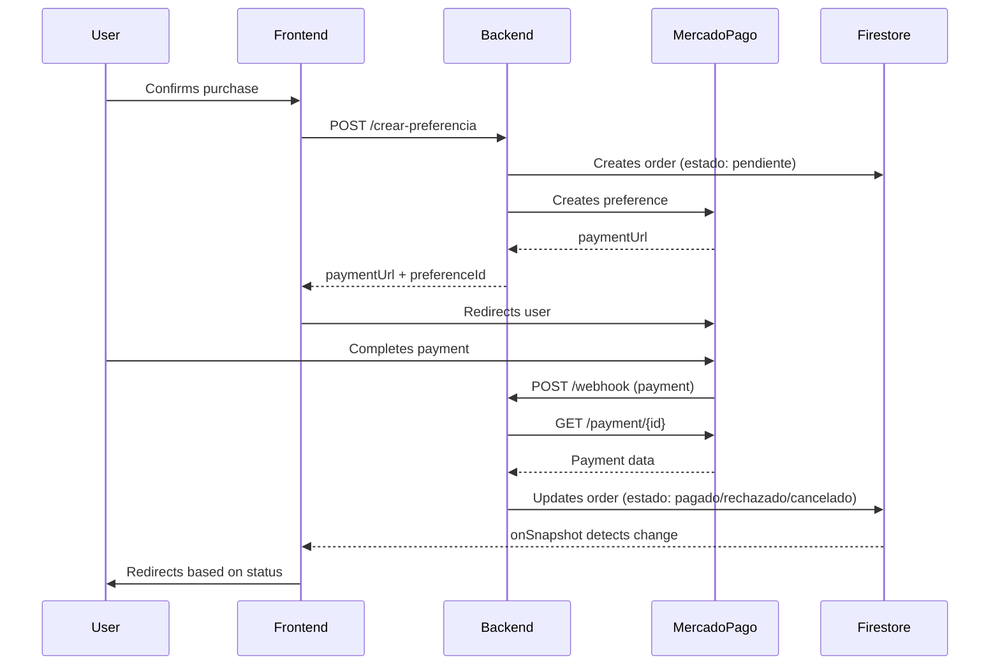

# 📚 Backend API Documentation - Medify

## 🔐 Base URL
```
http://localhost:8080/api
```

---

## 💳 Payment Endpoints

### 1. Create Payment Preference

Creates a payment preference in MercadoPago and an order in Firestore.

**Endpoint:** `POST /api/pagos/crear-preferencia`

**Headers:**
```
Content-Type: application/json
```

**Body:**
```json
{
  "nombreComercial": "Ibuprofen 600mg",         // ✅ REQUIRED
  "precio": 1500.50,                            // ✅ REQUIRED (> 0.01)
  "recetaId": "rec_123456",                     // ✅ REQUIRED
  "userId": "user_abc789",                      // ✅ REQUIRED
  "farmaciaId": "farm_xyz456",                  // ✅ REQUIRED
  "cotizacionId": "cot_abc123",                 // ✅ REQUIRED
  "imagenUrl": "https://example.com/image.jpg", // ✅ REQUIRED (must be valid URL)
  "direccion": {                                // ✅ REQUIRED
    "street": "742 Evergreen Terrace",          // ✅ REQUIRED
    "city": "Buenos Aires",                     // ✅ REQUIRED
    "province": "Buenos Aires",                 // ✅ REQUIRED
    "postalCode": "1234"                        // ✅ REQUIRED
  },
  "descripcion": "Anti-inflammatory 600mg"      // ⚪ OPTIONAL
}
```

**Required Fields:**
| Field | Type | Validation |
|-------|------|------------|
| `nombreComercial` | String | Not empty |
| `precio` | Double | Greater than 0.01 |
| `recetaId` | String | Not empty |
| `userId` | String | Not empty |
| `farmaciaId` | String | Not empty |
| `cotizacionId` | String | Not empty |
| `imagenUrl` | String | Valid URL |
| `direccion` | Object | Complete Address object |
| `direccion.street` | String | Not empty |
| `direccion.city` | String | Not empty |
| `direccion.province` | String | Not empty |
| `direccion.postalCode` | String | Not empty |

**Optional Fields:**
| Field | Type | Validation |
|-------|------|------------|
| `descripcion` | String | None |

**Successful Response (200 OK):**
```json
{
  "paymentUrl": "https://www.mercadopago.com.ar/checkout/v1/redirect?pref_id=123456789",
  "preferenceId": "123456789-abc-def-ghi-123456789"
}
```

**Errors:**
- `503 Service Unavailable`: MercadoPago not configured
- `502 Bad Gateway`: MercadoPago error
- `500 Internal Server Error`: Internal error
- `400 Bad Request`: Validation failed

**Usage:**
```javascript
const response = await fetch('/api/pagos/crear-preferencia', {
  method: 'POST',
  headers: { 'Content-Type': 'application/json' },
  body: JSON.stringify({
    nombreComercial: "Ibuprofen 600mg",
    precio: 1500.50,
    recetaId: "rec_123",
    userId: "user_abc",
    farmaciaId: "farm_xyz",
    cotizacionId: "cot_abc",
    imagenUrl: "https://example.com/image.jpg",
    direccion: {
      street: "742 Evergreen Terrace",
      city: "Buenos Aires",
      province: "Buenos Aires",
      postalCode: "1234"
    },
    descripcion: "Optional" // Only optional field
  })
});

const { paymentUrl } = await response.json();
window.location.href = paymentUrl; // Redirect to MercadoPago
```

---

### 2. MercadoPago Webhook

Receives automatic notifications from MercadoPago about payment changes.

**Endpoint:** `POST /api/pagos/webhook`

⚠️ **This endpoint is only for MercadoPago, DO NOT call from frontend**

**States handled:**
- `approved` → Order marked as "pagado" (paid)
- `rejected` → Order marked as "rechazado" (rejected)
- `cancelled` → Order marked as "cancelado" (cancelled)
- `pending` / `in_process` → Order marked as "pendiente" (pending)

---

### 3. Verify Payment Status

Verifies the current status of a payment in MercadoPago.

**Endpoint:** `GET /api/pagos/verificar/{paymentId}`

**Parameters:**
- `paymentId`: MercadoPago payment ID

**Successful Response (200 OK):**
```json
{
  "id": 1234567890,
  "status": "approved",
  "status_detail": "accredited",
  "transaction_amount": 1500.50,
  "currency_id": "ARS",
  "date_created": "2024-11-08T14:30:00.000-04:00",
  "external_reference": "pedido_abc123",
  "payer": {
    "email": "user@example.com"
  }
}
```

**Errors:**
- `400 Bad Request`: Invalid or not found payment ID
- `503 Service Unavailable`: MercadoPago not configured

**Usage:**
```javascript
const response = await fetch('/api/pagos/verificar/1234567890');
const payment = await response.json();
console.log(payment.status); // "approved", "rejected", etc.
```

---

### 4. Payment Health Check

Verifies the payment service status.

**Endpoint:** `GET /api/pagos/health`

**Response (200 OK):**
```json
{
  "status": "OK",
  "service": "API de pagos",
  "mercadoPagoConfigured": "true",
  "webhookSignatureValidation": "true"
}
```

---

## 🖼️ Image Endpoints

### 1. Upload Image

Uploads an image to Dropbox and returns the public URL and path.

**Endpoint:** `POST /api/imagenes/subir`

**Headers:**
```
Content-Type: multipart/form-data
```

**Form Data:**
- `file`: Image file (required)
- `carpeta`: Optional subfolder within `/medify/imagenes` (optional)

**Validations:**
- Allowed types: `image/jpeg`, `image/jpg`, `image/png`, `image/gif`, `image/webp`
- Maximum size: 10MB

**Successful Response (200 OK):**
```json
{
  "url": "https://dl.dropboxusercontent.com/s/abc123/20241108_143025_123456.jpg?raw=1",
  "path": "/medify/imagenes/20241108_143025_123456.jpg",
  "fileName": "prescription.jpg",
  "size": "245632"
}
```

**Errors:**
- `400 Bad Request`: Validation failed (empty file, type not allowed, size exceeded)
- `502 Bad Gateway`: Dropbox error
- `503 Service Unavailable`: Dropbox not configured
- `500 Internal Server Error`: Internal error

**Usage:**
```javascript
const formData = new FormData();
formData.append('file', imageFile);
formData.append('carpeta', 'prescriptions'); // Optional

const response = await fetch('/api/imagenes/subir', {
  method: 'POST',
  body: formData
});

const { url, path } = await response.json();

// Save both values:
// - url: to display the image
// - path: to delete it later
```

---

### 2. Delete Image

Deletes an image from Dropbox using its path.

**Endpoint:** `DELETE /api/imagenes/eliminar`

**Query Parameters:**
- `path`: Full path of the image in Dropbox (required)

**Example:**
```
DELETE /api/imagenes/eliminar?path=/medify/imagenes/20241108_143025_123456.jpg
```

**Successful Response (200 OK):**
```json
{
  "message": "Imagen eliminada correctamente"
}
```

**Errors:**
- `400 Bad Request`: Could not delete the image
- `503 Service Unavailable`: Dropbox not configured

**Usage:**
```javascript
const path = "/medify/imagenes/20241108_143025_123456.jpg";

const response = await fetch(`/api/imagenes/eliminar?path=${encodeURIComponent(path)}`, {
  method: 'DELETE'
});

const result = await response.json();
console.log(result.message);
```

---

### 3. Image Health Check

Verifies the storage service status.

**Endpoint:** `GET /api/imagenes/health`

**Response (200 OK):**
```json
{
  "status": "OK",
  "service": "API de imágenes",
  "dropboxConfigured": "true"
}
```

---

## 🔥 Firebase Integration

### Listen to Order Status in Real-Time

The frontend can listen to order status changes directly from Firestore:

```javascript
import { doc, onSnapshot } from 'firebase/firestore';
import { db } from './firebase-config';

function useOrderStatus(orderId) {
  useEffect(() => {
    if (!orderId) return;

    const unsubscribe = onSnapshot(
      doc(db, 'pedidos', orderId),
      (doc) => {
        if (doc.exists()) {
          const order = doc.data();
          
          console.log('Order status:', order.estado);
          // Possible states: "pendiente", "pagado", "rechazado", "cancelado"
          
          switch (order.estado) {
            case 'pagado':
              // Redirect to success page
              window.location.href = '/payment-success';
              break;
              
            case 'rechazado':
            case 'cancelado':
              // Redirect to error page
              window.location.href = '/payment-failed';
              break;
              
            case 'pendiente':
              // Show waiting message
              console.log('Waiting for payment confirmation...');
              break;
          }
        }
      },
      (error) => {
        console.error('Error listening to order:', error);
      }
    );

    return () => unsubscribe();
  }, [orderId]);
}
```

### Order Structure in Firestore

```javascript
pedidos/{orderId}
{
  // Basic information
  recetaId: "rec_123",
  farmaciaId: "farm_456",
  userId: "user_789",
  nombreComercial: "Ibuprofen 600mg",
  precio: 1500.50,
  cotizacionId: "cot_abc",
  imagenUrl: "https://...",
  
  // Shipping address
  addressUser: {
    street: "742 Evergreen Terrace",
    city: "Buenos Aires",
    province: "Buenos Aires",
    postalCode: "1234"
  },
  
  // Payment status
  estado: "pendiente" | "pagado" | "rechazado" | "cancelado",
  paymentId: "1234567890",
  paymentStatus: "approved" | "rejected" | "cancelled" | "pending",
  
  // Timestamps
  fechaCreacion: Timestamp,
  fechaActualizacion: Timestamp,
  fechaPago: Timestamp | null,
  fechaRechazo: Timestamp | null,
  fechaCancelacion: Timestamp | null
}
```

---

## 🔄 Complete Payment Flow



---

## 🔑 Required Environment Variables

```properties
# MercadoPago
mercadopago.access.token=YOUR_ACCESS_TOKEN
mercadopago.notification.url=https://your-domain.com/api/pagos/webhook
mercadopago.success.url=https://your-domain.com/payment-success
mercadopago.failure.url=https://your-domain.com/payment-failed
mercadopago.pending.url=https://your-domain.com/payment-pending
webhook.secret=YOUR_WEBHOOK_SECRET

# Dropbox
dropbox.access.token=YOUR_DROPBOX_TOKEN
dropbox.folder.path=/medify/imagenes

# Firebase
firebase.service.account.path=/path/to/serviceAccountKey.json
```

---

## ⚠️ Important Notes

### Payments
- **You CANNOT reuse a payment preference**. If a payment fails, you must create a new preference by calling `/crear-preferencia` again.
- The webhook automatically updates the status in Firestore. The frontend only needs to listen to changes.
- The states `pendiente`, `in_process`, `in_mediation` are mapped to `"pendiente"`.

### Images
- Always save both the `url` and `path` when uploading an image.
- The `url` is for displaying the image.
- The `path` is for deleting it later.
- Images are automatically named with timestamp to avoid collisions.

### Security
- The MercadoPago webhook validates the cryptographic signature if `webhook.secret` is configured.
- There is rate limiting to prevent abuse (10 webhooks/minute per payment).
- Duplicate webhooks are detected and rejected automatically.

---

## 🧪 Quick Testing

```bash
# Payment health check
curl http://localhost:8080/api/pagos/health

# Image health check
curl http://localhost:8080/api/imagenes/health

# Create preference (replace values)
curl -X POST http://localhost:8080/api/pagos/crear-preferencia \
  -H "Content-Type: application/json" \
  -d '{
    "nombreComercial": "Test",
    "precio": 100,
    "recetaId": "test123",
    "userId": "user123",
    "farmaciaId": "farm123",
    "cotizacionId": "cot123",
    "imagenUrl": "https://example.com/image.jpg",
    "direccion": {
      "street": "Test 123",
      "city": "CABA",
      "province": "Buenos Aires",
      "postalCode": "1234"
    }
  }'

# Upload image
curl -X POST http://localhost:8080/api/imagenes/subir \
  -F "file=@/path/to/image.jpg" \
  -F "carpeta=test"
```

---

## 📖 Additional Resources

### Payment Status Mapping

| MercadoPago Status | Internal Order Status | Description |
|-------------------|----------------------|-------------|
| `approved` | `pagado` | Payment successfully processed |
| `rejected` | `rechazado` | Payment rejected by bank/MP |
| `cancelled` | `cancelado` | User cancelled the payment |
| `pending` | `pendiente` | Payment awaiting confirmation |
| `in_process` | `pendiente` | Payment being processed |
| `in_mediation` | `pendiente` | Payment in dispute |

### Retry Failed Payment

If a payment was rejected or cancelled, you need to create a **NEW** preference:

```javascript
async function retryPayment(originalRecipe, address) {
  // Create a NEW preference (new order)
  const response = await fetch('/api/pagos/crear-preferencia', {
    method: 'POST',
    headers: { 'Content-Type': 'application/json' },
    body: JSON.stringify({
      nombreComercial: originalRecipe.nombreComercial,
      precio: originalRecipe.precio,
      recetaId: originalRecipe.id,
      userId: currentUser.uid,
      farmaciaId: originalRecipe.farmaciaId,
      cotizacionId: originalRecipe.cotizacionId,
      imagenUrl: originalRecipe.imagenUrl,
      direccion: address
    })
  });

  const { paymentUrl } = await response.json();
  
  // This creates a NEW order in Firestore
  // The previous order remains as historical with "rechazado" status
  
  window.location.href = paymentUrl;
}
```