# 📚 Documentación API Backend - Medify

## 🔐 Base URL
```
http://localhost:8080/api
```

---

## 💳 Endpoints de Pagos

### 1. Crear Preferencia de Pago

Crea una preferencia de pago en MercadoPago y un pedido en Firestore.

**Endpoint:** `POST /api/pagos/crear-preferencia`

**Headers:**
```
Content-Type: application/json
```

**Body:**
```json
{
  "nombreComercial": "Ibuprofeno 600mg",
  "precio": 1500.50,
  "recetaId": "rec_123456",
  "userId": "user_abc789",
  "farmaciaId": "farm_xyz456",
  "direccion": {
    "street": "Av. Siempre Viva 742",
    "city": "Buenos Aires",
    "province": "Buenos Aires",
    "postalCode": "1234"
  },
  "cotizacionId": "cot_opcional_123",
  "imagenUrl": "https://ejemplo.com/imagen.jpg",
  "descripcion": "Antiinflamatorio 600mg x 30 comprimidos"
}
```

**Validaciones:**
- `nombreComercial`: Requerido, no vacío
- `precio`: Requerido, mayor a 0.01
- `recetaId`: Requerido, no vacío
- `userId`: Requerido, no vacío
- `direccion`: Requerido, objeto Address válido
- `farmaciaId`: Opcional
- `cotizacionId`: Opcional
- `imagenUrl`: Opcional, debe ser URL válida
- `descripcion`: Opcional

**Respuesta Exitosa (200 OK):**
```json
{
  "paymentUrl": "https://www.mercadopago.com.ar/checkout/v1/redirect?pref_id=123456789",
  "preferenceId": "123456789-abc-def-ghi-123456789"
}
```

**Errores:**
- `503 Service Unavailable`: MercadoPago no configurado
- `502 Bad Gateway`: Error de MercadoPago
- `500 Internal Server Error`: Error interno
- `400 Bad Request`: Validación fallida

**Uso:**
```javascript
const response = await fetch('/api/pagos/crear-preferencia', {
  method: 'POST',
  headers: { 'Content-Type': 'application/json' },
  body: JSON.stringify({
    nombreComercial: "Ibuprofeno 600mg",
    precio: 1500.50,
    recetaId: "rec_123",
    userId: "user_abc",
    farmaciaId: "farm_xyz",
    direccion: {
      street: "Av. Siempre Viva 742",
      city: "Buenos Aires",
      province: "Buenos Aires",
      postalCode: "1234"
    }
  })
});

const { paymentUrl } = await response.json();
window.location.href = paymentUrl; // Redirigir a MercadoPago
```

---

### 2. Webhook de MercadoPago

Recibe notificaciones automáticas de MercadoPago sobre cambios en pagos.

**Endpoint:** `POST /api/pagos/webhook`

⚠️ **Este endpoint es solo para MercadoPago, NO llamar desde el frontend**

**Estados que maneja:**
- `approved` → Pedido marcado como "pagado"
- `rejected` → Pedido marcado como "rechazado"
- `cancelled` → Pedido marcado como "cancelado"
- `pending` / `in_process` → Pedido marcado como "pendiente"

---

### 3. Verificar Estado de Pago

Verifica el estado actual de un pago en MercadoPago.

**Endpoint:** `GET /api/pagos/verificar/{paymentId}`

**Parámetros:**
- `paymentId`: ID del pago de MercadoPago

**Respuesta Exitosa (200 OK):**
```json
{
  "id": 1234567890,
  "status": "approved",
  "status_detail": "accredited",
  "transaction_amount": 1500.50,
  "currency_id": "ARS",
  "date_created": "2024-11-08T14:30:00.000-04:00",
  "external_reference": "pedido_abc123",
  "payer": {
    "email": "usuario@example.com"
  }
}
```

**Errores:**
- `400 Bad Request`: Payment ID inválido o no encontrado
- `503 Service Unavailable`: MercadoPago no configurado

**Uso:**
```javascript
const response = await fetch('/api/pagos/verificar/1234567890');
const payment = await response.json();
console.log(payment.status); // "approved", "rejected", etc.
```

---

### 4. Health Check de Pagos

Verifica el estado del servicio de pagos.

**Endpoint:** `GET /api/pagos/health`

**Respuesta (200 OK):**
```json
{
  "status": "OK",
  "service": "API de pagos",
  "mercadoPagoConfigured": "true",
  "webhookSignatureValidation": "true"
}
```

---

## 🖼️ Endpoints de Imágenes

### 1. Subir Imagen

Sube una imagen a Dropbox y retorna la URL pública y el path.

**Endpoint:** `POST /api/imagenes/subir`

**Headers:**
```
Content-Type: multipart/form-data
```

**Form Data:**
- `file`: Archivo de imagen (requerido)
- `carpeta`: Subcarpeta opcional dentro de `/medify/imagenes` (opcional)

**Validaciones:**
- Tipos permitidos: `image/jpeg`, `image/jpg`, `image/png`, `image/gif`, `image/webp`
- Tamaño máximo: 10MB

**Respuesta Exitosa (200 OK):**
```json
{
  "url": "https://dl.dropboxusercontent.com/s/abc123/20241108_143025_123456.jpg?raw=1",
  "path": "/medify/imagenes/20241108_143025_123456.jpg",
  "fileName": "receta.jpg",
  "size": "245632"
}
```

**Errores:**
- `400 Bad Request`: Validación fallida (archivo vacío, tipo no permitido, tamaño excedido)
- `502 Bad Gateway`: Error de Dropbox
- `503 Service Unavailable`: Dropbox no configurado
- `500 Internal Server Error`: Error interno

**Uso:**
```javascript
const formData = new FormData();
formData.append('file', imageFile);
formData.append('carpeta', 'recetas'); // Opcional

const response = await fetch('/api/imagenes/subir', {
  method: 'POST',
  body: formData
});

const { url, path } = await response.json();

// Guardar ambos valores:
// - url: para mostrar la imagen
// - path: para eliminarla después
```

---

### 2. Eliminar Imagen

Elimina una imagen de Dropbox usando su path.

**Endpoint:** `DELETE /api/imagenes/eliminar`

**Query Parameters:**
- `path`: Path completo de la imagen en Dropbox (requerido)

**Ejemplo:**
```
DELETE /api/imagenes/eliminar?path=/medify/imagenes/20241108_143025_123456.jpg
```

**Respuesta Exitosa (200 OK):**
```json
{
  "message": "Imagen eliminada correctamente"
}
```

**Errores:**
- `400 Bad Request`: No se pudo eliminar la imagen
- `503 Service Unavailable`: Dropbox no configurado

**Uso:**
```javascript
const path = "/medify/imagenes/20241108_143025_123456.jpg";

const response = await fetch(`/api/imagenes/eliminar?path=${encodeURIComponent(path)}`, {
  method: 'DELETE'
});

const result = await response.json();
console.log(result.message);
```

---

### 3. Health Check de Imágenes

Verifica el estado del servicio de almacenamiento.

**Endpoint:** `GET /api/imagenes/health`

**Respuesta (200 OK):**
```json
{
  "status": "OK",
  "service": "API de imágenes",
  "dropboxConfigured": "true"
}
```

---

## 🔥 Integración con Firebase

### Escuchar Estado del Pedido en Tiempo Real

El frontend puede escuchar cambios en el estado del pedido directamente desde Firestore:

```javascript
import { doc, onSnapshot } from 'firebase/firestore';
import { db } from './firebase-config';

function usePedidoStatus(pedidoId) {
  useEffect(() => {
    if (!pedidoId) return;

    const unsubscribe = onSnapshot(
      doc(db, 'pedidos', pedidoId),
      (doc) => {
        if (doc.exists()) {
          const pedido = doc.data();
          
          console.log('Estado del pedido:', pedido.estado);
          // Estados posibles: "pendiente", "pagado", "rechazado", "cancelado"
          
          switch (pedido.estado) {
            case 'pagado':
              // Redirigir a página de éxito
              window.location.href = '/pago-exitoso';
              break;
              
            case 'rechazado':
            case 'cancelado':
              // Redirigir a página de error
              window.location.href = '/pago-fallido';
              break;
              
            case 'pendiente':
              // Mostrar mensaje de espera
              console.log('Esperando confirmación del pago...');
              break;
          }
        }
      },
      (error) => {
        console.error('Error escuchando pedido:', error);
      }
    );

    return () => unsubscribe();
  }, [pedidoId]);
}
```

### Estructura del Pedido en Firestore

```javascript
pedidos/{pedidoId}
{
  // Información básica
  recetaId: "rec_123",
  farmaciaId: "farm_456",
  userId: "user_789",
  nombreComercial: "Ibuprofeno 600mg",
  precio: 1500.50,
  cotizacionId: "cot_abc",
  imagenUrl: "https://...",
  
  // Dirección de envío
  addressUser: {
    street: "Av. Siempre Viva 742",
    city: "Buenos Aires",
    province: "Buenos Aires",
    postalCode: "1234"
  },
  
  // Estado del pago
  estado: "pendiente" | "pagado" | "rechazado" | "cancelado",
  paymentId: "1234567890",
  paymentStatus: "approved" | "rejected" | "cancelled" | "pending",
  
  // Timestamps
  fechaCreacion: Timestamp,
  fechaActualizacion: Timestamp,
  fechaPago: Timestamp | null,
  fechaRechazo: Timestamp | null,
  fechaCancelacion: Timestamp | null
}
```

---

## 🔄 Flujo Completo de Pago

```mermaid
sequenceDiagram
    participant U as Usuario
    participant F as Frontend
    participant B as Backend
    participant MP as MercadoPago
    participant FB as Firestore

    U->>F: Confirma compra
    F->>B: POST /crear-preferencia
    B->>FB: Crea pedido (estado: pendiente)
    B->>MP: Crea preferencia
    MP-->>B: paymentUrl
    B-->>F: paymentUrl + preferenceId
    F->>MP: Redirige usuario
    U->>MP: Completa pago
    MP->>B: POST /webhook (payment)
    B->>MP: GET /payment/{id}
    MP-->>B: Payment data
    B->>FB: Actualiza pedido (estado: pagado/rechazado/cancelado)
    FB-->>F: onSnapshot detecta cambio
    F->>U: Redirige según estado
```



---

## 🔑 Variables de Entorno Necesarias

```properties
# MercadoPago
mercadopago.access.token=YOUR_ACCESS_TOKEN
mercadopago.notification.url=https://tu-dominio.com/api/pagos/webhook
mercadopago.success.url=https://tu-dominio.com/pago-exitoso
mercadopago.failure.url=https://tu-dominio.com/pago-fallido
mercadopago.pending.url=https://tu-dominio.com/pago-pendiente
webhook.secret=YOUR_WEBHOOK_SECRET

# Dropbox
dropbox.access.token=YOUR_DROPBOX_TOKEN
dropbox.folder.path=/medify/imagenes

# Firebase
firebase.service.account.path=/path/to/serviceAccountKey.json
```

---

## ⚠️ Notas Importantes

### Pagos
- **NO se puede reutilizar una preferencia de pago**. Si un pago falla, debes crear una nueva preferencia llamando nuevamente a `/crear-preferencia`.
- El webhook actualiza automáticamente el estado en Firestore. El frontend solo debe escuchar los cambios.
- Los estados `pendiente`, `in_process`, `in_mediation` se mapean a `"pendiente"`.

### Imágenes
- Siempre guarda tanto el `url` como el `path` al subir una imagen.
- El `url` es para mostrar la imagen.
- El `path` es para eliminarla después.
- Las imágenes se nombran automáticamente con timestamp para evitar colisiones.

### Seguridad
- El webhook de MercadoPago valida la firma criptográfica si `webhook.secret` está configurado.
- Hay rate limiting para evitar abuso (10 webhooks/minuto por payment).
- Los webhooks duplicados se detectan y rechazan automáticamente.

---

## 🧪 Testing Rápido

```bash
# Health check de pagos
curl http://localhost:8080/api/pagos/health

# Health check de imágenes
curl http://localhost:8080/api/imagenes/health

# Crear preferencia (reemplaza los valores)
curl -X POST http://localhost:8080/api/pagos/crear-preferencia \
  -H "Content-Type: application/json" \
  -d '{
    "nombreComercial": "Test",
    "precio": 100,
    "recetaId": "test123",
    "userId": "user123",
    "direccion": {
      "street": "Test 123",
      "city": "CABA",
      "province": "Buenos Aires",
      "postalCode": "1234"
    }
  }'

# Subir imagen
curl -X POST http://localhost:8080/api/imagenes/subir \
  -F "file=@/path/to/image.jpg" \
  -F "carpeta=test"
```